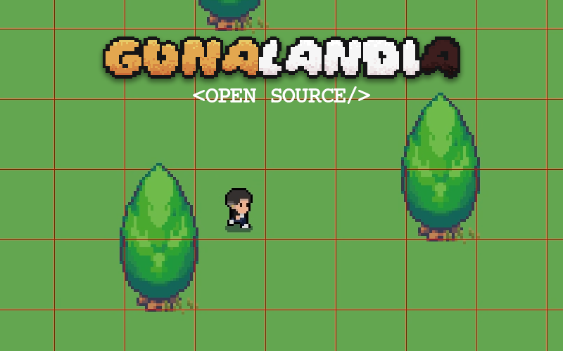

# Gunolândia

Gunolândia is a 2D game written in C# using Windows Forms (WinForms). It was created as a high school programming class project, where the goal was to develop our own unique project and present it to the rest of the class. Inspired by the style of classic 2D games like *Pokémon*, Gunolândia features core gameplay mechanics such as collisions, procedural map generation, animated sprites, and music playback.

## Features

### 1. **Core Game Mechanics**
- **Collision Detection**: Players cannot walk through obstacles or out of bounds.
- **Procedural Map Generation**: The map is generated dynamically, making each gameplay experience unique.

### 2. **Animated Sprites**
- Sprites change animations based on the player's direction (up, down, left, right) and actions (walking, idle).
- Smooth transitions create an engaging visual experience.

### 3. **Music Playback**
- Background music adds immersion to the gameplay.
- The game supports seamless playback of audio files.

---

## Technologies Used
- **Language**: C#
- **Framework**: Windows Forms (WinForms)

---

## How It Was Made
The development process involved several stages:
1. **Planning**: Defining the concept and features of the game.
2. **Coding**: Implementing game mechanics, such as:
   - Collision detection logic.
   - Procedural generation algorithm.
   - Animated sprite rendering system.
   - Audio playback integration.
3. **Testing**: Debugging and improving performance.
4. **Presentation**: Demonstrating the game to classmates at the end of the project.

---

## Lessons Learned
This project was an opportunity to:
- Apply programming concepts in a practical and creative way.
- Learn about game development fundamentals like animations, procedural generation, and multimedia integration.
- Work collaboratively and present a finished project to an audience.

---

## How to Run
1. Clone the repository to your local machine.
2. Open the project in an IDE that supports C# and WinForms, such as Visual Studio.
3. Build and run the project.

---

## Acknowledgments
- Our programming teacher for guiding and encouraging us throughout the project.
- Classmates for their feedback and support during the presentation.
- Inspiration from classic 2D games for shaping the concept of Gunolândia.

---

## License
This project was created as part of a school assignment and is shared for educational purposes. Feel free to explore and learn from it!

